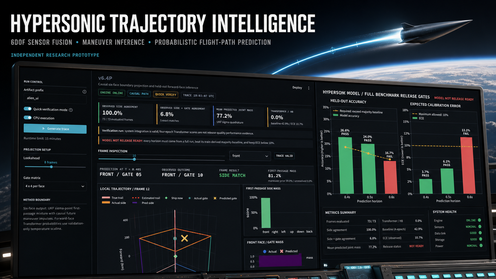
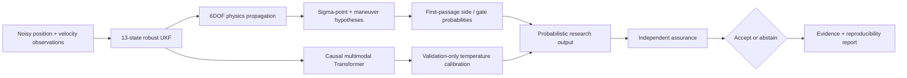
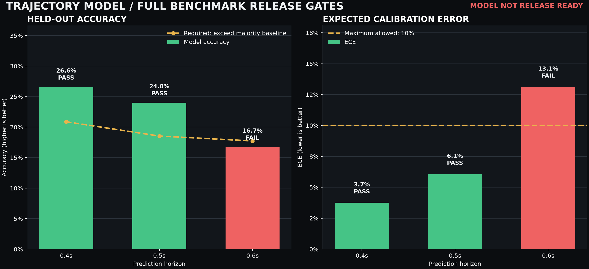

# Hypersonic Trajectory Intelligence

[](https://github.com/sciencemaths-collab/hypersonic-trajectory-intelligence/actions/workflows/ci.yml)


**Physics-informed short-horizon trajectory inference with uncertainty-aware boundary prediction, independent assurance, and reproducible research evidence.**



## Research Release 0.7

This repository is an independent aerospace research prototype. It combines a rotating-Earth 6DOF simulator, nonlinear state estimation, probabilistic physics rollouts, a causal Transformer, calibration, and a new independent assurance/evidence layer.

Release 0.7 does **not** claim operational readiness. Its purpose is to make the prototype technically reviewable: assumptions are explicit, validation weaknesses are surfaced instead of hidden, benchmark artifacts are portable, and CI checks numerical/engineering integrity across supported Python versions.

The project is not affiliated with, endorsed by, or developed on behalf of NASA, the United States Government, or any aerospace organization.

## What Changed in 0.7

- Added `hti.assurance`, an independent post-prediction layer for confidence, normalized entropy, top-class margin, abstention, and split-conformal prediction sets.
- Added `scripts/evidence_gate.py`, which separates **engineering-integrity** checks from **scientific-readiness** checks.
- Added Python 3.10–3.12 CI, source compilation, unit verification, linting, dependency auditing, and machine-readable evidence reports.
- Sanitized the recorded benchmark artifact so it no longer contains workstation-specific absolute paths.
- Added explicit benchmark provenance and a class-coverage audit.
- Added requirements traceability, external-validation protocol, architecture, security policy, and a NASA-oriented research-readiness mapping.
- Added a concise proposal brief for technical evaluation discussions.

## Current Readiness

| Layer | Status | Meaning |
|---|---|---|
| Core physics/estimation implementation | Research prototype | Numerically tested on synthetic scenarios |
| Software engineering integrity | CI-enforced | Compilation, unit tests, linting, dependency audit, evidence-schema checks |
| Recorded benchmark | Mixed | 0.4 s and 0.5 s pass the original accuracy/calibration gates; 0.6 s does not |
| Class coverage | Insufficient for broad generalization claims | Validation and test contain only 4 of 16 gate classes at each recorded horizon |
| Multi-seed evidence | Incomplete | Current versioned benchmark records one seed |
| External/domain validation | Not yet performed | Synthetic data only |
| Operational/safety-critical use | **Not approved** | No certification or operational validation is claimed |

This distinction is intentional. A research system is stronger when it can say precisely **where the evidence stops**.

## System Architecture



The current implementation remains largely self-contained in `alien_exit_cell_predictor_v6_3.py`; the assurance layer is intentionally independent so it can audit probability outputs without changing the underlying predictor.

See [docs/ARCHITECTURE.md](docs/ARCHITECTURE.md) for component boundaries and the modularization path.

## Core Method

The system processes noisy simulated position and velocity observations and estimates short-horizon boundary-crossing behavior. The research implementation includes:

- ECEF central gravity with Coriolis and centrifugal terms;
- 13-state position/velocity/quaternion/angular-rate estimation;
- covariance repair and innovation gating;
- 27 UKF sigma-point rollouts;
- first-passage probability over six local safety-volume faces;
- transparent future-maneuver hypothesis mixtures;
- causal interleaved feature/control Transformer tokens;
- per-horizon temperature calibration fitted on validation data only; and
- independent confidence/entropy/margin abstention plus split-conformal prediction sets.

## Recorded Benchmark

The versioned full benchmark contains 48 disjoint trajectory groups and 4,224 windows.

| Horizon | Accuracy | Majority baseline | Balanced accuracy | Top-3 | ECE | Original gate |
|---|---:|---:|---:|---:|---:|---|
| 0.4 s | 26.6% | 20.9% | 26.7% | 72.3% | 3.7% | Pass |
| 0.5 s | 24.0% | 18.5% | 24.4% | 70.3% | 6.1% | Pass |
| 0.6 s | 16.7% | 17.7% | 17.3% | 65.8% | 13.1% | Fail |



### Evidence audit

The original aggregate table is not enough for an external-readiness claim. The recorded class coverage is:

| Horizon | Train | Validation | Test |
|---|---:|---:|---:|
| 0.4 s | 11/16 | 4/16 | 4/16 |
| 0.5 s | 8/16 | 4/16 | 4/16 |
| 0.6 s | 5/16 | 4/16 | 4/16 |

That limitation is now machine-checked.

Run the audit:

```bash
python scripts/evidence_gate.py \
  benchmark_v64_maneuver_calibrated_metrics.json \
  --report evidence_report.json
```

To intentionally fail when the current evidence is not strong enough for external scientific-readiness criteria:

```bash
python scripts/evidence_gate.py \
  benchmark_v64_maneuver_calibrated_metrics.json \
  --fail-on scientific
```

The current recorded benchmark is expected to fail that second command. That is a feature, not a bug.

## Quick Start

### Install

```bash
git clone https://github.com/sciencemaths-collab/hypersonic-trajectory-intelligence.git
cd hypersonic-trajectory-intelligence
python3 -m venv .venv
source .venv/bin/activate
python -m pip install --upgrade pip
pip install -r requirements.txt
```

Windows PowerShell:

```powershell
.venv\Scripts\Activate.ps1
```

### GUI

```bash
streamlit run streamlit_app.py
```

### Command line

```bash
python alien_exit_cell_predictor_v6_3.py \
  --quick --no-gpu --no-viz --output-prefix demo
```

Remove `--quick` for the larger research configuration.

## Assurance API

The assurance layer accepts a class-probability vector and can abstain when a distribution is too diffuse.

```python
import numpy as np
from hti import assess_prediction

decision = assess_prediction(np.array([0.62, 0.18, 0.12, 0.08]))
print(decision.accept, decision.reason)
```

For calibrated set-valued predictions, use `conformal_quantile` on a frozen calibration split and `conformal_prediction_set` on subsequent predictions. Final test data must not be used to tune assurance thresholds.

## Verification

Run the unit suite:

```bash
python -m unittest -v test_v63.py test_assurance.py
```

Run the existing fast stress probe:

```bash
python stress_test_fast.py --seeds 0,1,2 --traj 18 --mode diversity
```

Regenerate the benchmark chart:

```bash
python plot_benchmark_thresholds.py
```

The GitHub Actions workflow additionally compiles the assurance/evidence layer, lints new code, audits dependencies, and uploads the evidence audit as a CI artifact.

## Intended Research Uses

Appropriate proposal and collaboration directions include:

- launch and reentry telemetry research;
- spacecraft or high-speed vehicle corridor-departure monitoring;
- range-safety and keep-out-volume research;
- space-debris or air/space traffic boundary-crossing studies;
- sensor-fusion and state-estimation experiments;
- probabilistic short-horizon forecasting under uncertain dynamics;
- autonomous collision-avoidance research where abstention and uncertainty are explicit; and
- modeling-and-simulation methodology research.

This repository should not be used as the sole basis for navigation, flight control, targeting, interception, weapons control, or decisions affecting human safety.

## NASA-Oriented Research Readiness

The documentation is structured so an evaluator can map the project to themes in NASA modeling/simulation, software-engineering, and software-assurance practice without claiming NASA compliance or certification.

- [NASA research-readiness mapping](docs/NASA_RESEARCH_READINESS.md)
- [Requirements traceability](docs/REQUIREMENTS_TRACEABILITY.md)
- [External validation protocol](docs/EXTERNAL_VALIDATION_PROTOCOL.md)
- [Validation report](VALIDATION_REPORT.md)
- [Architecture](docs/ARCHITECTURE.md)
- [Proposal brief](docs/PROPOSAL_BRIEF.md)

Official references used for the mapping include NASA-STD-7009B / NASA-HDBK-7009B, NPR 7150.2D, and NASA-STD-8739.8.

## Known Scientific Gaps

- Synthetic trajectories only.
- Simplified aerodynamics and upper-atmosphere behavior.
- Quaternion uncertainty is represented in Euclidean UKF coordinates instead of a manifold error-state formulation.
- Current benchmark class coverage is incomplete.
- Current versioned benchmark is single-seed.
- The longest recorded horizon fails both the original accuracy-vs-baseline and ECE gates.
- No independent external sensor or high-fidelity simulator validation is recorded.
- No claim of operational reliability, certification, or flightworthiness is made.

## Security and Responsible Use

See [SECURITY.md](SECURITY.md). Do not commit credentials, private telemetry, controlled technical data, or sensitive operational datasets. Model and array loading paths should remain non-executable (`weights_only=True` for PyTorch state loading where applicable and `allow_pickle=False` for NumPy archives).

## Contributing

Changes that affect scientific claims should include tests, an explicit hypothesis, frozen evaluation criteria, and updated evidence. Do not tune release thresholds after inspecting final test results.

## License

Released under the [MIT License](LICENSE).
