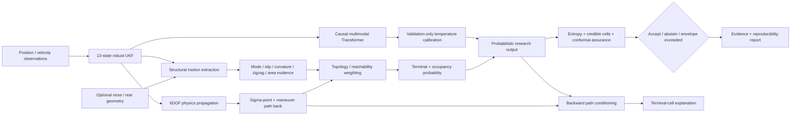

# Hypersonic Trajectory Intelligence

[](https://github.com/sciencemaths-collab/hypersonic-trajectory-intelligence/actions/workflows/ci.yml)


**Physics-informed short-horizon trajectory inference with structural-motion reasoning, topology-aware probability, calibrated uncertainty, backward explanation, and reproducible research evidence.**


## Research Release 0.8

HTI 0.8 is an architecture and verification upgrade for an independent aerospace research prototype. It preserves the rotating-Earth 6DOF simulator, robust nonlinear state estimation, probabilistic physics rollouts, causal Transformer, calibration, and assurance work from 0.7, then adds a separate **structural-motion + topology + entropy + backward-explanation layer**.

The new layer is based on the mathematical construction developed in the supplied *Unified Topological-Entropy Trajectory Inference* technical note. Its strongest ideas are incorporated without replacing the existing physics engine.

Release 0.8 does **not** claim operational readiness or improved real-world accuracy. The new algebraic and software properties are tested, but predictive improvement must still be demonstrated through frozen multi-seed ablations and external/domain validation.

The project is not affiliated with, endorsed by, or developed on behalf of NASA, the United States Government, or any aerospace organization.

## What Changed in 0.8

- Added `hti.topological_entropy` with invertible nose/rear geometry in 2D and 3D.
- Added structural motion extraction: body direction/length, slip angle, turn rate, curvature, swept area, zigzag statistics, deformation rate, and explanatory motion-mode evidence.
- Added topology/reachability path weighting with explicit monotonic penalties.
- Added 3D spherical keep-out-volume intersection scoring for non-sensitive corridor and safety research.
- Added separate occupancy and terminal-cell probability utilities.
- Added entropy concentration and probability-sorted credible-cell summaries.
- Added Bayesian backward conditioning for explaining which stored paths and modes support a selected terminal cell.
- Added `scripts/hti_structural_analysis.py` for observed endpoint CSVs or existing HTI trace artifacts.
- Added a dedicated 0.8 architecture document and a falsification/validation protocol.
- Added 13 new unit tests for the source-derived mathematical invariants and structural behavior.
- Expanded CI and evidence manifests to cover the 0.8 layer.

## Current Readiness

| Layer | Status | Meaning |
|---|---|---|
| Core physics/estimation implementation | Research prototype | Numerically tested on synthetic scenarios |
| HTI 0.8 structural/topological implementation | Unit-verified architecture | Mathematical/software invariants tested; predictive gain not yet claimed |
| Software engineering integrity | CI-enforced | Compilation, unit tests, linting, dependency audit, evidence-schema checks |
| Recorded benchmark | Mixed | 0.4 s and 0.5 s pass the original aggregate gates; 0.6 s does not |
| Class coverage | Insufficient for broad generalization claims | Validation and test contain only 4 of 16 gate classes at each recorded horizon |
| Multi-seed evidence | Incomplete | Current versioned benchmark records one seed |
| External/domain validation | Not yet performed | Synthetic data only |
| Operational/safety-critical use | **Not approved** | No certification or operational validation is claimed |

The versioned 0.7 benchmark is **not** relabeled as a 0.8 performance result. A new experiment is required to test whether the added structural and topological information actually improves prediction.

## HTI 0.8 Architecture



The core predictor remains largely self-contained in `alien_exit_cell_predictor_v6_3.py`. The 0.8 layer is intentionally modular so it can be ablated or disabled without changing the core estimator.

See:

- [HTI 0.8 architecture](docs/HTI_0_8_ARCHITECTURE.md)
- [Topological-entropy validation plan](docs/TOPOLOGICAL_ENTROPY_VALIDATION.md)
- [Core architecture](docs/ARCHITECTURE.md)

## Core Method

The system processes noisy simulated position and velocity observations and estimates short-horizon boundary-crossing behavior. The research implementation includes:

- ECEF central gravity with Coriolis and centrifugal terms;
- 13-state position/velocity/quaternion/angular-rate estimation;
- covariance repair and innovation gating;
- 27 UKF sigma-point rollouts;
- first-passage probability over six local safety-volume faces;
- transparent future-maneuver hypothesis mixtures;
- causal interleaved feature/control Transformer tokens;
- per-horizon temperature calibration fitted on validation data only;
- independent confidence/entropy/margin abstention plus split-conformal prediction sets;
- optional two-point structural geometry and motion descriptors;
- topology/reachability reweighting of candidate-path support; and
- backward conditioning of stored path hypotheses for explanation.

## Structural-Motion Layer

For an observed nose `n_t` and rear `b_t`, HTI 0.8 uses:

```text
c_t = (n_t + b_t) / 2

a_t = n_t - b_t

L_t = ||a_t||

h_t = a_t / L_t
```

The transform is invertible for non-zero body length:

```text
n_t = c_t + a_t/2
b_t = c_t - a_t/2
```

Recent endpoint history is converted into:

```text
center + body direction + length
+ velocity + travel direction
+ slip angle + turn rate + curvature
+ swept area + zigzag structure
+ deformation rate + mode evidence
```

The mode evidence currently distinguishes straight, coordinated-turn, alternating-zigzag, drift, and deforming regimes. These are transparent explanatory priors, **not learned intent probabilities**.

## Topology-Aware Probability

A candidate path may be down-weighted by a non-negative feasibility penalty:

```text
R(path) = exp[-alpha*d - beta*N_barrier - gamma*D_history]
```

and then renormalized:

```text
w'_m = w_m R(path_m) / sum_r w_r R(path_r)
```

HTI 0.8 includes a generic topology weight and 3D spherical safety-volume intersection utility. These are intended for corridor, keep-out-volume, range-safety, air/space traffic, and similar non-sensitive research.

## Probability, Entropy, and Explanation

Terminal and occupancy probability are kept separate.

For one terminal cell per retained path:

```text
P_terminal(C_i) = sum_m w_m I[terminal_m = i] / sum_m w_m
```

For occupancy:

```text
P_occ(C_i) = sum_m w_m I[path_m visits i] / sum_m w_m
```

Occupancy probabilities do not need to sum to one because one path can visit several cells.

Entropy concentration is:

```text
H_N = -sum_i p_i log(p_i) / log(K)
Q = 1 - H_N
```

`Q` describes concentration, not correctness. It is reported beside the peak prediction and is **not multiplied into every cell score**.

A backward explanation can condition the retained path bank on a selected terminal cell:

```text
w_back_m(C_j) = w_m I[terminal_m = j] / sum_r w_r I[terminal_r = j]
```

This answers which candidate paths or modes support the selected cell. It does not claim unique reversal of a stochastic trajectory.

## Structural Analysis CLI

Preferred input is observed endpoint geometry:

```bash
python scripts/hti_structural_analysis.py \
  --endpoint-csv observations.csv \
  --out hti08_structural.json
```

Minimum CSV columns:

```text
time,nose_x,nose_y,rear_x,rear_y
```

Optional 3D columns:

```text
nose_z,rear_z
```

Existing HTI trace artifacts can also be analyzed:

```bash
python scripts/hti_structural_analysis.py \
  --online-trace demo_online_trace.npz \
  --body-length 20 \
  --out demo_structural.json
```

The current trace artifact does not store attitude, so trace mode uses velocity direction only as an explicit orientation proxy. The output marks this as degraded proxy evidence.

For non-sensitive safety-volume analysis, repeat `--keepout x,y,z,radius` to reweight the final stored sigma-path bank by zone intersection.

## Python API

```python
import numpy as np
from hti import (
    EndpointObservation,
    estimate_structural_motion,
    summarize_distribution,
)

observations = [
    EndpointObservation(0.0, (1.0, 0.0), (-1.0, 0.0)),
    EndpointObservation(1.0, (2.0, 0.4), (0.0, 0.4)),
    EndpointObservation(2.0, (3.0, 1.1), (1.0, 1.1)),
]

features = estimate_structural_motion(observations)
summary = summarize_distribution(np.array([0.60, 0.25, 0.10, 0.05]))

print(features.mode_probabilities)
print(summary.predicted_cell, summary.entropy_concentration)
```

## Recorded Benchmark

The current versioned full benchmark contains 48 disjoint trajectory groups and 4,224 windows.

| Horizon | Accuracy | Majority baseline | Balanced accuracy | Top-3 | ECE | Original gate |
|---|---:|---:|---:|---:|---:|---|
| 0.4 s | 26.6% | 20.9% | 26.7% | 72.3% | 3.7% | Pass |
| 0.5 s | 24.0% | 18.5% | 24.4% | 70.3% | 6.1% | Pass |
| 0.6 s | 16.7% | 17.7% | 17.3% | 65.8% | 13.1% | Fail |


### Evidence audit

The recorded class coverage is:

| Horizon | Train | Validation | Test |
|---|---:|---:|---:|
| 0.4 s | 11/16 | 4/16 | 4/16 |
| 0.5 s | 8/16 | 4/16 | 4/16 |
| 0.6 s | 5/16 | 4/16 | 4/16 |

Run the evidence audit:

```bash
python scripts/evidence_gate.py \
  benchmark_v64_maneuver_calibrated_metrics.json \
  --report evidence_report.json
```

To intentionally fail when the current evidence does not satisfy the stronger external scientific-readiness gates:

```bash
python scripts/evidence_gate.py \
  benchmark_v64_maneuver_calibrated_metrics.json \
  --fail-on scientific
```

The current recorded benchmark is expected to fail that second command.

## Quick Start

### Install

```bash
git clone https://github.com/sciencemaths-collab/hypersonic-trajectory-intelligence.git
cd hypersonic-trajectory-intelligence
python3 -m venv .venv
source .venv/bin/activate
python -m pip install --upgrade pip
pip install -r requirements.txt
```

Windows PowerShell:

```powershell
.venv\Scripts\Activate.ps1
```

### GUI

```bash
streamlit run streamlit_app.py
```

### Core command line

```bash
python alien_exit_cell_predictor_v6_3.py \
  --quick --no-gpu --no-viz --output-prefix demo
```

Remove `--quick` for the larger research configuration.

## Assurance API

The assurance layer accepts a class-probability vector and can abstain when a distribution is too diffuse.

```python
import numpy as np
from hti import assess_prediction

decision = assess_prediction(np.array([0.62, 0.18, 0.12, 0.08]))
print(decision.accept, decision.reason)
```

For calibrated set-valued predictions, use `conformal_quantile` on a frozen calibration split and `conformal_prediction_set` on subsequent predictions. Final test data must not be used to tune assurance thresholds.

## Verification

Run the unit suite:

```bash
python -m unittest -v \
  test_v63.py \
  test_assurance.py \
  test_topological_entropy.py
```

The HTI 0.8 tests cover endpoint invertibility, circular wrap invariance, structural mode normalization, topology monotonicity, topology reweighting, terminal normalization, cell-prior renormalization, entropy/credible sets, occupancy semantics, backward consistency, conditional mode/state explanation, and 3D keep-out-zone intersection behavior.

Run the existing fast stress probe:

```bash
python stress_test_fast.py --seeds 0,1,2 --traj 18 --mode diversity
```

Regenerate the benchmark chart:

```bash
python plot_benchmark_thresholds.py
```

The GitHub Actions workflow additionally verifies Python 3.10–3.12, compiles the research modules, lints them, audits dependencies, builds SHA-256 evidence manifests, and uploads the evidence bundle.

## Required 0.8 Falsification Program

Before saying the new architecture improves prediction, the project must run identical event-level splits and seeds across at least:

1. constant velocity;
2. filter/direct extrapolation;
3. physics-only;
4. learned-only where scientifically fair;
5. core HTI;
6. core + two-point structural features;
7. core + topology weighting; and
8. combined HTI 0.8.

Required measurements include calibration, top-k accuracy, geometric cell error, 95% credible-region coverage/size, conformal coverage/size, entropy-versus-error deciles, robustness under missing/noisy/swapped endpoints, and topology failure cases.

See [docs/TOPOLOGICAL_ENTROPY_VALIDATION.md](docs/TOPOLOGICAL_ENTROPY_VALIDATION.md).

## Intended Research Uses

Appropriate proposal and collaboration directions include:

- launch and reentry telemetry research;
- spacecraft or high-speed vehicle corridor-departure monitoring;
- range-safety and keep-out-volume research;
- space-debris or air/space traffic boundary-crossing studies;
- sensor-fusion and state-estimation experiments;
- probabilistic short-horizon forecasting under uncertain dynamics;
- autonomous collision-avoidance research where abstention and uncertainty are explicit; and
- modeling-and-simulation credibility methodology.

This repository should not be used as the sole basis for navigation, flight control, targeting, interception, weapons control, or decisions affecting human safety.

## NASA-Oriented Research Readiness

The documentation is structured so an evaluator can map the project to themes in NASA modeling/simulation, software-engineering, and software-assurance practice without claiming NASA compliance or certification.

- [NASA research-readiness mapping](docs/NASA_RESEARCH_READINESS.md)
- [Requirements traceability](docs/REQUIREMENTS_TRACEABILITY.md)
- [External validation protocol](docs/EXTERNAL_VALIDATION_PROTOCOL.md)
- [HTI 0.8 architecture](docs/HTI_0_8_ARCHITECTURE.md)
- [HTI 0.8 validation/falsification plan](docs/TOPOLOGICAL_ENTROPY_VALIDATION.md)
- [Validation report](VALIDATION_REPORT.md)
- [Core architecture](docs/ARCHITECTURE.md)
- [Proposal brief](docs/PROPOSAL_BRIEF.md)

Official references used for the broader readiness mapping include NASA-STD-7009B / NASA-HDBK-7009B, NPR 7150.2D, and NASA-STD-8739.8.

## Known Scientific Gaps

- Synthetic trajectories only.
- Simplified aerodynamics and upper-atmosphere behavior.
- Quaternion uncertainty is represented in Euclidean UKF coordinates instead of a manifold error-state formulation.
- Current benchmark class coverage is incomplete.
- Current versioned benchmark is single-seed.
- The longest recorded horizon fails both the original accuracy-vs-baseline and ECE gates.
- The 0.8 structural/topological layer has not yet been evaluated on a new frozen benchmark.
- Existing online traces do not record attitude; structural trace-mode orientation is therefore explicitly a velocity proxy.
- No independent external sensor or high-fidelity simulator validation is recorded.
- No claim of operational reliability, certification, or flightworthiness is made.

## Security and Responsible Use

See [SECURITY.md](SECURITY.md). Do not commit credentials, private telemetry, controlled technical data, or sensitive operational datasets. Model and array loading paths should remain non-executable (`weights_only=True` for PyTorch state loading where applicable and `allow_pickle=False` for NumPy archives).

## Contributing

Changes that affect scientific claims should include tests, an explicit hypothesis, frozen evaluation criteria, and updated evidence. Do not tune release thresholds after inspecting final test results.

## License

Released under the [MIT License](LICENSE).
