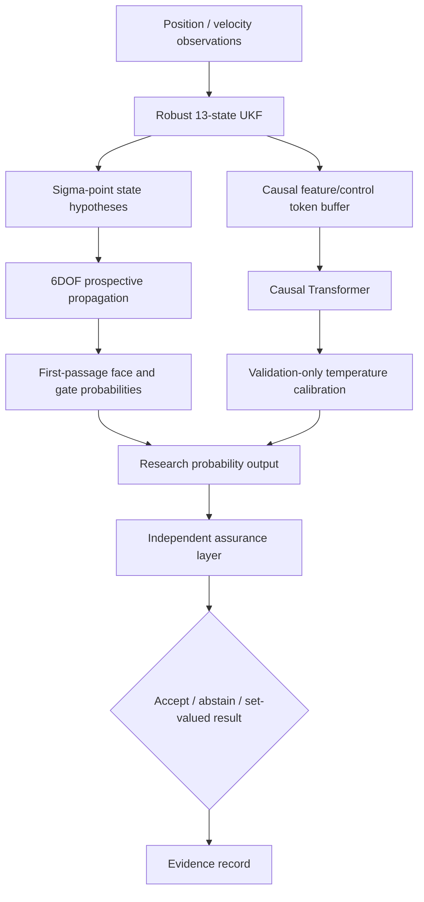

# Architecture

## Purpose

Hypersonic Trajectory Intelligence is structured as a research pipeline for short-horizon probabilistic boundary-crossing inference. The architecture separates prediction from assurance so uncertainty checks can reject or qualify outputs without silently changing the predictor.

## Logical data flow



## Current implementation boundaries

### `alien_exit_cell_predictor_v6_3.py`

Legacy self-contained research engine. Despite the filename, its internal banner identifies the current algorithm family as v6.4 probabilistic. The mismatch is retained temporarily to avoid breaking existing commands and will be removed during a future modular package migration.

Major responsibilities:

- configuration and reproducibility seeding;
- quaternion utilities;
- Earth/atmosphere/aerodynamic approximations;
- 6DOF propagation;
- robust UKF state estimation;
- virtual safety-volume geometry;
- synthetic trajectory generation;
- causal dataset construction and trajectory-isolated splits;
- Transformer training/evaluation;
- validation-only calibration;
- probabilistic rollouts; and
- output artifact generation.

### `streamlit_app.py`

Human-facing research console. It launches the engine as a bounded subprocess, reads JSON/NPZ artifacts, and visualizes trajectory and probability information.

### `hti/assurance.py`

Independent post-prediction assurance API:

- probability validation;
- normalized entropy;
- confidence margin;
- deterministic abstention thresholds;
- split-conformal threshold fitting; and
- set-valued prediction coverage measurement.

The assurance module does not import the engine and can therefore be tested independently.

### `scripts/evidence_gate.py`

Evidence auditor. It distinguishes:

1. **engineering-integrity checks**, which can block CI; and
2. **scientific-readiness checks**, which describe whether the recorded evidence is strong enough for a broader external claim.

This prevents a scientific limitation from being confused with a software crash, while also preventing a green build badge from being interpreted as proof of model validity.

## Trust boundaries

- Final test data must not tune model hyperparameters, temperature, abstention thresholds, or evidence thresholds.
- Versioned evidence must be portable and must not contain workstation-specific absolute paths.
- NumPy archives are loaded with `allow_pickle=False`.
- PyTorch state loading should use `weights_only=True` where supported.
- The Streamlit application should not be exposed as an unauthenticated internet service for sensitive data.
- No credentials or private telemetry should be stored in the repository.

## Target modular architecture

The next structural refactor should move the monolithic engine into stable packages without changing validated behavior:

```text
hti/
  physics/
  estimation/
  geometry/
  data/
  models/
  calibration/
  assurance/
  evidence/
  cli/
```

The migration should be behavior-preserving and verified against frozen numerical fixtures before new algorithmic changes are introduced.
