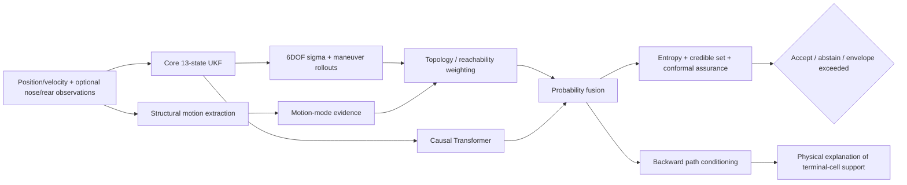

# HTI 0.8 Architecture: Structural Motion, Topology, and Entropy

## Status

HTI 0.8 is an architecture and verification upgrade for an independent aerospace research prototype. It does not convert the project into operational, flight-certified, targeting, interception, or safety-critical software.

The design basis for this layer is the August 2026 technical note **Unified Topological-Entropy Trajectory Inference**, which develops a mathematically consistent two-point geometry, topology-weighted path distribution, entropy diagnostic, and forward/backward Bayesian construction. HTI adapts those ideas to coexist with the existing 6DOF/UKF/Transformer stack rather than replacing it.

## Why this layer exists

The existing predictor already models translation, velocity, attitude, angular rate, nonlinear estimation uncertainty, physics rollouts, maneuver hypotheses, learned temporal features, and calibration. HTI 0.8 adds a complementary question:

> What does the recent trajectory structure say about the forecast, and how should reachability/topology change the probability mass?

This includes observable or estimated body orientation, deformation, slip between pointing and travel direction, curvature, alternating turn structure, swept area, topology constraints, distribution concentration, credible cell sets, and backward explanation of a selected terminal cell.

## Architectural principle

The new variables are **not automatically inserted into the 13-state UKF**. They are derived structural features and evidence channels. This avoids inflating the estimator state with quantities that are better treated as functions of recent observations or higher-level hypotheses.



## 1. Endpoint geometry

For nose `n_t` and rear `b_t` observations:

```text
c_t = (n_t + b_t) / 2

a_t = n_t - b_t

L_t = ||a_t||

h_t = a_t / L_t
```

The transform preserves endpoint information whenever `L_t > 0` because:

```text
n_t = c_t + a_t/2
b_t = c_t - a_t/2
```

HTI 0.8 implements this in `endpoint_geometry` and `recover_endpoints`, with a round-trip unit test.

### Integration with existing HTI traces

The preferred source is independently observed or independently estimated nose/rear geometry. For compatibility with the existing state pipeline, `endpoint_observations_from_centerline` can construct the two-point representation from center, direction, and body length.

A velocity-derived direction is allowed only as an explicit **proxy**. It must not be described as independently observed attitude. The structural-analysis CLI records whether the orientation source is observed or a degraded velocity proxy.

## 2. Structural motion features

The structural layer derives:

- center position;
- body direction and length;
- velocity and speed;
- smoothed travel direction;
- slip angle between body direction and travel direction;
- signed turn rate;
- curvature;
- signed swept area;
- zigzag score and latest alternating-turn bias;
- body-length rate; and
- transparent motion-mode evidence.

The current explanatory modes are:

- `straight`;
- `coordinated_turn`;
- `alternating_zigzag`;
- `drift`; and
- `deforming`.

These mode values are **transparent heuristic evidence**, not learned operational intent probabilities. Their purpose is interpretability, ablation, and hypothesis weighting.

## 3. Circular and 3D turn handling

2D heading is smoothed through unit phasors rather than arithmetic angle averaging. This prevents the 359-degree/1-degree discontinuity.

For 3D trajectories, HTI 0.8 smooths unit travel directions directly. Signed turn rate is estimated relative to the dominant recent turn plane from successive direction cross-products. If no stable turn plane exists, the implementation falls back conservatively rather than inventing a unique signed plane.

## 4. Swept area and zigzag structure

Swept area is used only as a structural descriptor. It is not substituted for displacement or physical work.

For 2D, the implementation uses a local shoelace-style signed area. For 3D, it forms an area vector from the recent path relative to the first point in the analysis window and signs the magnitude relative to the recent turn orientation.

Alternating signed turn rates are preserved rather than collapsed into a single regression slope. This allows a short history with left/right alternation to remain distinguishable from a smooth coordinated turn.

## 5. Topology and reachability weighting

The base topology factor is:

```text
R(path) = exp[-alpha*d - beta*N_barrier - gamma*D_history]
```

where all penalties and coefficients are non-negative. Therefore `R(path)` is in `(0, 1]`.

HTI 0.8 implements:

- generic scalar topology weighting;
- normalized multiplication of topology support into path weights; and
- 3D spherical keep-out-volume intersection counts for non-sensitive safety/reachability studies.

For candidate path weight `w_m`:

```text
w'_m = w_m R(path_m) / sum_r w_r R(path_r)
```

A path with a larger violation penalty cannot gain relative support from this factor alone.

### Safety scope

The built-in volume utility is for corridor, keep-out-volume, air/space traffic, range-safety research, and similar non-sensitive reachability studies. It is not an intercept-guidance or weapons-control module.

## 6. Terminal and occupancy probability

For one terminal cell per retained candidate path:

```text
P_terminal(C_i) = sum_m w_m I[terminal_m = i] / sum_m w_m
```

The implementation checks that the result is normalized.

Occupancy is kept separate:

```text
P_occ(C_i) = sum_m w_m I[path_m visits i] / sum_m w_m
```

Occupancy probabilities do not need to sum to one because one path may visit several cells.

A cell-level prior may be applied only by multiplication followed by renormalization:

```text
P'_i = P_i r_i / sum_j P_j r_j
```

## 7. Entropy and concentration

For terminal probabilities `P` over `K` cells:

```text
H(P) = -sum_i p_i log p_i
H_N = H / log K
Q = 1 - H_N
```

`Q` is a concentration diagnostic in `[0, 1]`.

**Q is not accuracy.** It is not multiplied into every cell score because it is identical across the cells of one forecast and therefore cannot change the argmax.

HTI 0.8 reports:

- peak cell;
- peak probability;
- normalized entropy;
- entropy concentration; and
- the shortest probability-sorted credible cell set reaching a requested mass such as 95%.

The existing `hti.assurance` conformal prediction set remains a separate frequentist calibration layer. Bayesian credible cells and conformal sets answer different questions and are intentionally both available.

## 8. Backward explanation

The forward path bank is retained as an explanation substrate. For selected terminal cell `C_j`:

```text
w_back_m(C_j) = w_m I[terminal_m = j] / sum_r w_r I[terminal_r = j]
```

HTI 0.8 can then compute:

- normalized conditional path support;
- conditional motion-mode support; and
- conditional expected state histories when path states are supplied.

This does not uniquely reverse a stochastic process. It conditions the forward joint particle/path distribution on one terminal outcome.

## 9. Non-identifiability boundary

HTI explicitly adopts the following scientific boundary:

If future speed/direction/control may change arbitrarily with no physical bound, stochastic law, control model, or new observation, a unique future terminal cell is not identifiable from the past alone.

The correct response to an exceeded predictive envelope is therefore wider uncertainty or abstention, not fabricated precision.

## 10. Software interfaces

Primary implementation:

```text
hti/topological_entropy.py
```

CLI bridge:

```text
scripts/hti_structural_analysis.py
```

The CLI accepts either observed endpoint CSV or an existing `*_online_trace.npz`. Trace mode currently derives body direction from velocity because the current trace artifact does not store attitude; the JSON output labels this as degraded orientation evidence.

## 11. What 0.8 does not claim

The 0.8 unit suite establishes implementation properties such as endpoint round-trip recovery, angle-wrap invariance, normalized mode evidence, monotone topology penalties, normalized terminal distributions, proper cell-prior renormalization, credible-set mass behavior, occupancy semantics, backward conditional normalization/consistency, and 3D safety-zone intersection counting.

Those checks establish **internal mathematical/engineering consistency**. They do not show that the new features improve predictive accuracy on real or held-out trajectory data.

That empirical claim remains gated by `docs/TOPOLOGICAL_ENTROPY_VALIDATION.md` and the P0 scientific-validation issue.

## 12. Next scientific experiment

After CI is green, compare the same frozen event-level splits and seeds under:

1. center/velocity baseline;
2. core HTI physics/learned predictor;
3. core + two-point structural features;
4. core + topology weighting;
5. core + structural + topology; and
6. combined model with entropy/abstention diagnostics.

No final-test threshold should be changed after those final-test results are inspected.
